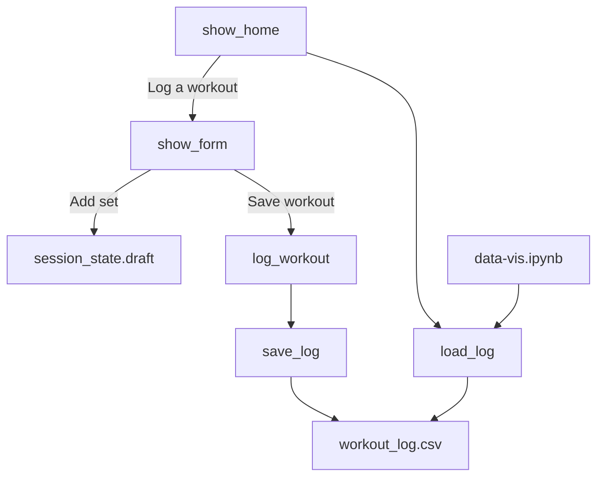

# LiftLog — Developer's Guide

## Overview

LiftLog is a personal strength-training tracker. Users log workouts (exercise, set number, reps, weight, notes) through a Streamlit UI. History is stored in a local CSV file (`workout_log.csv`). The Streamlit app supports reviewing past sessions with a date filter. Progress charts live in a separate Jupyter notebook (`data-vis.ipynb`), not in the app UI.

There is no remote server, database, or API keys—everything runs locally against the CSV.

## Condensed Design Specs

Original design material lives in this folder, especially [Workout Tracker App Specs Doc - Revised.pdf](Workout%20Tracker%20App%20Specs%20Doc%20-%20Revised.pdf) (also sketches and review PDFs).

### Implemented

- Static exercise library (`exercises.py`)
- Set-level workout logging (reps, weight, notes per set)
- CSV persistence via `liftlog.py` (`save_log` / `load_log`)
- Streamlit UI: home page with date-filtered history, form page to log a workout
- In-session draft workout before save (`st.session_state.draft`)
- Plotly weight-history visualization in `data-vis.ipynb`

### Not implemented / deferred

- Charts and personal-record (PR) detection inside the Streamlit app
- Edit or delete of past workouts in the UI
- Adding custom exercises from the UI (library is code-only)
- Multi-user accounts or cloud sync

## Install / Deployment / Admin

Baseline setup matches the README: **Python 3.13.11**, `pip install -r requirements.txt`, then `streamlit run app.py` from the project root.

Admin notes beyond the user guide:

- **Local only.** No deployment target, environment variables, or secrets. Dependencies are `streamlit`, `pandas`, and `plotly`.
- **Working directory.** Run Streamlit (and the CLI seed script) from the project root so relative paths resolve to `workout_log.csv`.
- **CSV must exist.** `load_log()` calls `pd.read_csv` with no create-if-missing path. A missing file raises `FileNotFoundError`. The repo ships with a sample CSV.
- **`run_cli.py` is not the app.** It hardcodes a sample workout and **appends** it to the CSV. Use it only for seeding/demo; running it repeatedly duplicates data.
- **`old/`** holds archived experiments. Ignore it for production behavior; current entry points are `app.py`, `liftlog.py`, `exercises.py`, and `data-vis.ipynb`.

## Internal Code Walkthrough

### User interaction flow

1. User opens the app → `show_home()` loads the CSV and shows a filterable history table.
2. User clicks **Log a workout** → `st.session_state.page` becomes `"form"` → `show_form()`.
3. User fills date / exercise / reps / weight / notes and clicks **Add set** → sets accumulate in `st.session_state.draft` as `(exercise_name, [(reps, weight, notes), ...])` pairs.
4. User clicks **Save workout** → draft is passed to `log_workout()`, then `save_log()` writes CSV → draft clears and UI returns home.

### Code path (modules)



| Module | Role |
|--------|------|
| [`app.py`](../app.py) | Streamlit UI. Session keys: `page` (`"home"` / `"form"`), `draft` (in-progress workout). `show_home()` filters and displays the log; `show_form()` builds the draft and saves. |
| [`liftlog.py`](../liftlog.py) | Data layer. Schema via `empty_log()`; rows via `build_set` → `log_exercise` → `log_workout`; I/O via `save_log` / `load_log`. |
| [`exercises.py`](../exercises.py) | Static `exercise_library`. The UI selectbox uses `name` only; other fields are metadata for later use. |
| [`run_cli.py`](../run_cli.py) | Developer seed script; appends a hardcoded workout. |
| [`data-vis.ipynb`](../data-vis.ipynb) | Analytics: `get_exercise_history()` filters one lift; `plot_weight_history()` draws a Plotly line chart. |

### Hierarchy (logging)

```
log_workout(df, date, exercises)
  └── for each (exercise_name, sets):
        log_exercise(date, exercise_name, sets)
          └── for each (reps, weight, notes):
                build_set(...)  → row dict
  └── pd.concat onto df (returns new frame; does not mutate in place)
```

CSV columns: `date`, `exercise_name`, `set_number`, `reps`, `weight`, `notes`.

## Known Issues

### Minor

- Choosing a date range with no matching rows shows a warning (“No workouts found…”). Expected behavior, not a crash.

### Major

- **Missing CSV:** If `workout_log.csv` is absent, `load_log()` raises `FileNotFoundError` and the app will not load. Workaround: restore the file from git or recreate a CSV with the correct headers.
- **Same-day re-logs:** `log_workout()` always appends. Logging again for a date that already has entries creates duplicate rows (see also `bug.md`). There is no upsert or replace-by-date.

### Optional / technical debt

- Visualization only in the notebook, not Streamlit.
- Exercise list is hardcoded; no UI to extend it.
- No edit/delete of historical rows in the UI.

## Future Work

- Create an empty CSV (via `empty_log()` + `save_log()`) when the file is missing.
- Upsert or replace workouts for a given date instead of blind appends.
- Move weight-history charts (and optional PR detection) into the Streamlit app.
- Allow custom exercises in the UI (or load the library from a file).

## Summary (TLDR)

1. Start with **`liftlog.py`**—schema and CSV I/O are the core.
2. **`app.py`** is a thin Streamlit shell over that API; drafts live in session state until save.
3. **`workout_log.csv` is the database**; keep it in the project root.
4. **`data-vis.ipynb`** is for charts; the live app does not plot yet.
5. Watch for **missing CSV** and **duplicate rows on re-log** when you change logging behavior.
